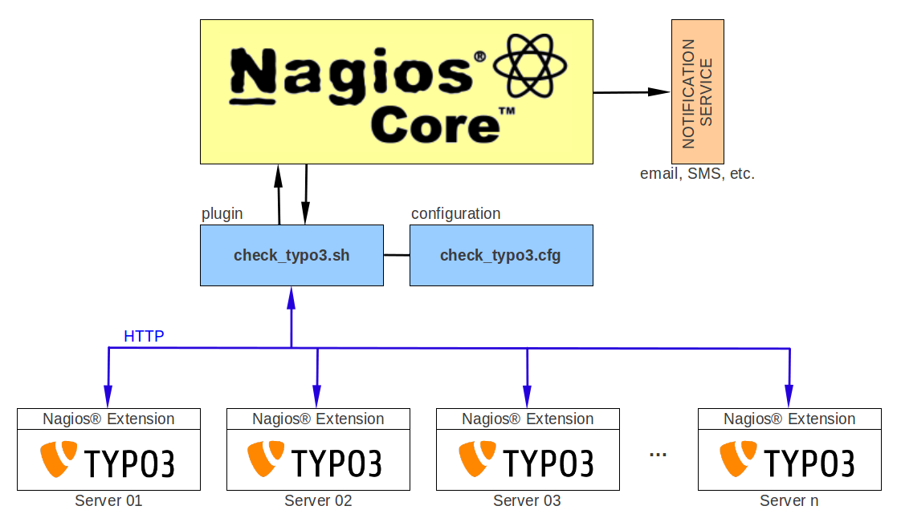

# Technical Concept

The following illustration shows the technical concept of a typical Nagios® monitoring system.

The Nagios® core executes the plugin `check_typo3.sh` in a configurable time interval. The plugin reads the configuration (`check_typo3.cfg`) and initiates an HTTP/HTTPS request to the TYPO3 server, typically to the URL `/nagios`.

TYPO3 receives the request and executes the TYPO3 extension “Nagios” which checks if the requesting Nagios® server is allowed to access the data. If this is the case, the extension gathers details about the TYPO3 instance (all information is configurable in the TYPO3 backend) and generates the output in a propriety format (text/plain).

The Nagios® plugin reads the response, analyzes the data, and checks the information against its configuration. According to the configuration, one of the following states is reported back to the Nagios® Core (in addition to a meaningful description):

- **OK**
- **WARNING**
- **CRITICAL**
- **UNKNOWN**

Finally, the Nagios® Core reacts appropriately to this state and notifies system administrators in case of a problem. This depends on the Nagios® configuration and could be, for example, an email, a text message to a mobile phone, a message to a team collaboration platform such as [Slack](https://slack.com), etc.

---

➤ Read next: [Screenshots](../Screenshots/Index.md).
